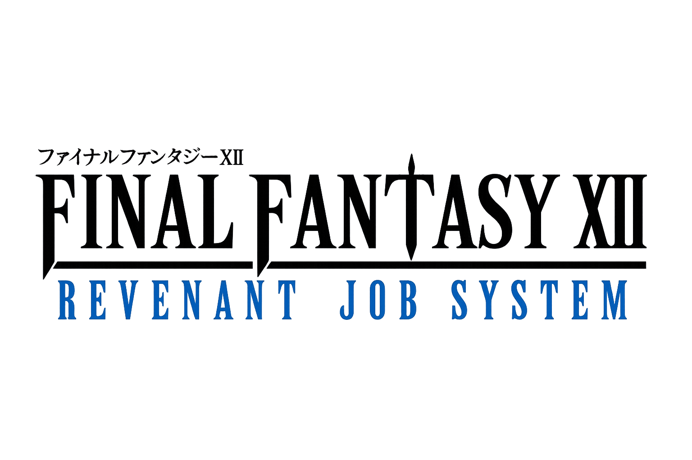

<h1 align="center"> Final Fantasy XII: Revenant Job System (PS2) </h1>

  

## Overview

A comprehensive overhaul mod inspired by classic Final Fantasy titles, designed to enhance gameplay depth, balance, and customization.

### Features

- **Over 32 New Weapons!** Wield legendary relics and restored beta content like the classic Knife, Zantetsuken, Buster Sword, and Hero's Blade!
- **Tactical Ammunition!** Get ready to use 4 new Arrows and 4 new Shots with elemental and status properties, like Holy Arrows and Virus Shots!
- **Ninja Swords** are now One-Handed Weapons!
- **Accessories Overhaul!** Every single accessory in the game has been altered with different stats, making each one a unique and strategic choice for your builds!
- **New 12 Job Classes Recreated:** Choose your path! A complete rebuild from scratch with new nodes.
- **New Exclusive Skills & Spells:** Characters now possess unique Innate Skills right from the start, independent of their chosen Job.
- **Magicks Overhaul:** The entire set of Magicks has been renewed and correctly described.
- **Stats Explosion!** Attribute growth significantly increases after Level 50 to prepare your party for the toughest endgame enemies.
- **Harder Bosses:** Get ready for a real challenge.
- **New Enemies:** Face off against deadly new foes such as Doppelgangers!
- **Vital Stealing:** Robbing special enemies and bosses is now super important for high-tier equipment!
- **New Balanced Shops:** Customized shops built specifically for the mod! With great power comes great responsibility!
- **New Menus Translation:** The UI is now fully rebranded to FFXII RJS.

## Installation

1. Open the **Releases** section on the right sidebar of this repository.
2. Under **Assets**, download the `FFXII-RJS.zip` archive.
3. Extract the archive to any location on your computer.
4. Place an English-patched version of the **FFXII International Zodiac Job System (IZJS)** ISO in the same directory as the `bin_izjs` folder.
5. Rename the ISO file to `ff12zj.iso`.
6. Run `patch.exe` to inject the mod files from `bin_izjs` into `ff12zj.iso`.

After the process is complete, open the modified ISO with an emulator of your choice. If the installation was successful, you will see the new title screen.

## Ownership & Permissions

This mod was developed from the ground up without using files or assets from other mods.

All content was created manually and thoroughly tested by myself.

## Credits

- [Sky Pirate's Den](https://discord.gg/UBrP6ME) – for support and valuable feedback.
- [ffgriever](https://www.nexusmods.com/profile/ffgriever) – for creating the ISO patcher used to inject files into the game ISO.
- [Xeavin](https://www.nexusmods.com/profile/Xeavin) – for creating the patch that allows to use the 7 reserve licenses nodes, modding support, tools, and ideas.
- [Aquarius Camus](https://www.nexusmods.com/profile/AquariusCamus34) – for guidance on modifying game files and providing tools.
- [Akita](https://www.nexusmods.com/profile/Akita1957) & [Shrimpman](https://www.nexusmods.com/profile/SShrimpman) – for beta testing.
- [FehDead](https://www.nexusmods.com/profile/fehdead) – for support and ideas.
- Paulo Ítalo & João – for ideas such as restoring classic weapons like the Holy Katana and Mutsunokami.
- Mikachuuu – for assistance with Gemini Plus and brainstorming.
- vsub – for sharing save data.
