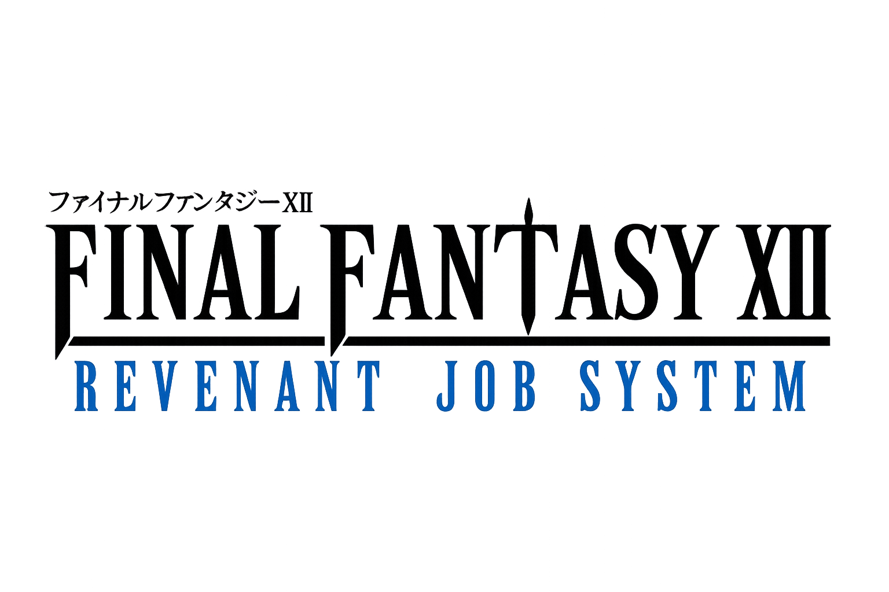

<h1 align="center"> Final Fantasy XII: Revenant Job System (PS2) </h1>

  

## Overview

A comprehensive overhaul mod inspired by classic Final Fantasy titles, designed to enhance gameplay depth, balance, and customization.

### Features

- **Completely Overhauled Equipment:** Wield legendary relics and restored beta content like the classic Knife, Zantetsuken, Brotherhood Fratani, Revolver Gunblade, and Hero's Blade!
- **Overhauled Ammunition!** Prepare yourself for new effects from ammunition, archery, and bombs in the game, such as Holy Arrows, Holy Shot, or DARK ~ Chaos Bombs for your Piercing and Unique Hand-Bomb Blassty Weapon!
- **Accessories Overhaul!** Every single accessory in the game has been altered with different stats, making each one a unique and strategic choice for your builds!
- **The 12 Job Classes Renewed:** It is now possible to use all Espers on any job without losing anything, or enjoy exclusive perks, such as the Bless Knight being able to use the Hero's Blade, or the Flick Sniper using the Seiten-Taisei!
- **New Exclusive Skills & Spells:** Characters now possess unique Innate Skills right from the start, independent of their chosen Job.
- **Magicks & Technicks Overhaul:** The entire set of Magicks and Technicks has been overhauled and remade, featuring 3 to 4 levels for each elemental Magick (Earth has 3), such as Ice Break, Quake, Pyromance, or Deluge (enemies that possessed these magicks have lost them for the sake of progression). You can now play using Water, Watera, Waterga, Aero, Aerora, Aeroga (up to tier 4 - Deluge/Tempest). You can even use Technicks like All-Out—a powerful attack with a piercing effect that ignores enemy defense, evasion, etc.
- **Harder Bosses:** Get ready for a more elegant way of battling bosses, similar to older FF titles, featuring higher HP, MP, etc., for a better overall experience.
- **Enemy Overhaul:** Every single enemy was buffed by 1.5x to increase the difficulty, reminiscent of older FF games, and some have had their steal tables modified for new Bazaar items!
- **New Bazaar Items:** Check out the Bazaar items and conversions in the downloadable TXT file. Convert, create, and obtain new equipment or other items from the Bazaar, making it more useful and unique!
- **Vital Stealing:** Robbing special enemies and bosses is now super important for high-tier equipment!
- **Colored Elementals:** Each elemental weapon, Magick, or related item has been color-coded to help you visually!
- **New Balanced Shops:** Customized shops built specifically for the mod! With great power comes great responsibility!

## Installation

1. Open the **Releases** section on the right sidebar of this repository.
2. Under **Assets**, download the `FFXII-RJS.zip` archive.
3. Extract the archive to any location on your computer.
4. Place an English-patched version of the **FFXII International Zodiac Job System (IZJS)** ISO in the same directory as the `bin_izjs` folder.
5. Rename the ISO file to `ff12zj.iso`.
6. Run `patch.exe` to inject the mod files from `bin_izjs` into `ff12zj.iso`.

After the process is complete, open the modified ISO with an emulator or play it using OPL. If the installation was successful, you will see the new title screen with "REVENANT JOB SYSTEM".

# Coming Soon...

## Ownership & Permissions

This mod was developed from the ground up without using files or assets from other mods.

**All content was created manually and thoroughly tested by myself, Akita, MidnightZR, and KellueHaze!**

## Credits

- [Sky Pirate's Den](https://discord.gg/UBrP6ME) – for support and valuable feedback.
- [ffgriever](https://www.nexusmods.com/profile/ffgriever) – for creating the ISO patcher used to inject files into the game ISO.
- [Xeavin](https://www.nexusmods.com/profile/Xeavin) – for creating the patch that allows the use of the 7 reserve license nodes, modding support, tools, and ideas.
- [Aquarius Camus](https://www.nexusmods.com/profile/AquariusCamus34) – for guidance on modifying game files and providing tools.
- [Akita](https://www.nexusmods.com/profile/Akita1957) & [Shrimpman](https://www.nexusmods.com/profile/SShrimpman) – for beta testing.
- [FehDead](https://www.nexusmods.com/profile/fehdead) – for support and ideas.
- Paulo Ítalo & João – for ideas such as restoring classic weapons like the Holy Katana and Mutsunokami.
- MidnightZR & Kelluehaze – for being special tester members and providing support throughout the entire project.
- Mikachuuu – for assistance with Gemini Plus and brainstorming.
